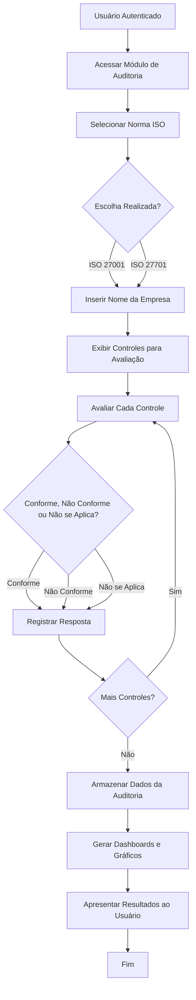
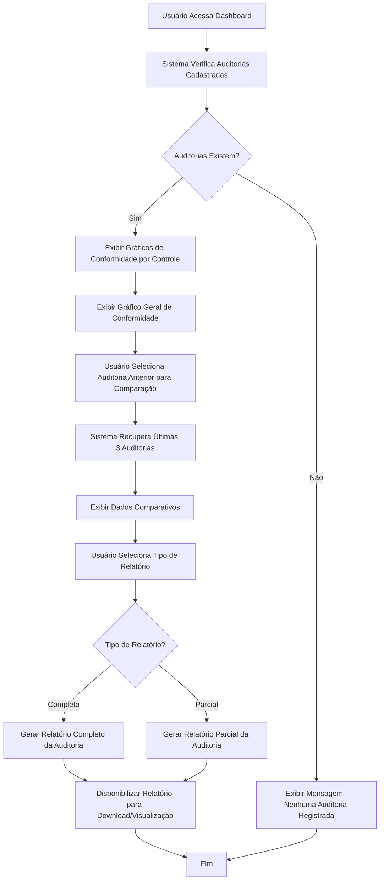
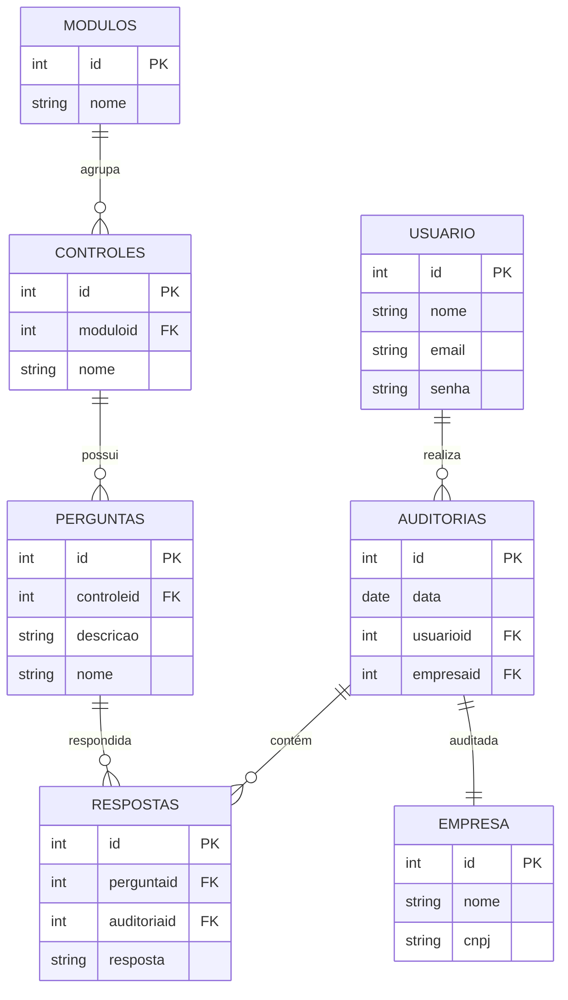

# Documentação Final do Sistema CyberSec

## 1. Apresentação 
O sistema CyberSec foi desenvolvido com o objetivo de fornecer uma base moderna e escalável para aplicações voltadas à auditoria de segurança da informação. A aplicação busca auxiliar organizações no gerenciamento centralizado de auditorias de conformidade às normas ISO/IEC 27001 e ISO/IEC 27701.

## 2. Problema 
Muitas organizações encontram dificuldades no gerenciamento de auditorias de segurança da informação devido à ausência de ferramentas centralizadas e eficientes. Além disso, sistemas antigos apresentam limitações tecnológicas, falta de integrações e dificuldades na geração de relatórios comparativos.

## 3. Objetivos 

### 3.1. Objetivo Geral 
Desenvolver uma aplicação web moderna para gerenciamento e acompanhamento de auditorias de segurança da informação. 

### 3.2. Objetivos Específicos 
- Criar uma interface intuitiva 
- Desenvolver uma API 
- Integrar banco de dados SQL para armazenamento das informações
- Auxiliar auditorias relacionadas às normas ISO/IEC 27001 e ISO/IEC 27701
- Disponibilizar gráficos e relatórios para acompanhamento das auditorias

## 4. Justificativa 
A segurança da informação tornou-se um fator essencial para organizações de diferentes setores. Dessa forma, ferramentas que auxiliem processos de auditoria e conformidade são indispensáveis.

## 5. Funcionalidades do Sistema
### 5.1. Descrição

O sistema busca auxiliar o processo de auditoria de conformidade das normas ISO 27001 e ISO 27701, fornecendo recursos para gerenciamento de empresas, execução de auditorias, acompanhamento de resultados através de dashboards interativos e geração de relatórios em PDF.

### 5.2. Dashboard Inicial

O dashboard inicial apresenta uma visão geral do sistema, exibindo indicadores principais relacionados às auditorias realizadas. Nessa tela são apresentados:

- Total de auditorias registradas no sistema;
- Total de empresas cadastradas;
- Quantidade de auditorias referentes às normas ISO 27001 e ISO 27701.

Além disso, a página exibe uma tabela contendo as cinco auditorias mais recentes, considerando as datas mais próximas da data atual.

No canto superior direito é apresentado o perfil do auditor autenticado no sistema, juntamente com um botão destinado à criação de uma nova auditoria. Já no canto esquerdo encontra-se o menu lateral para navegação entre as funcionalidades.

### 5.3. Cadastro e Inicialização de Auditorias

Ao selecionar a opção de nova auditoria, o sistema direciona o usuário para uma tela onde é possível:

- Cadastrar uma empresa;
- Selecionar o módulo de auditoria que será iniciado.

Após o salvamento da empresa, o sistema questiona se o usuário deseja iniciar imediatamente uma auditoria. Em caso positivo, é exibida a norma correspondente ao módulo selecionado e o processo de auditoria é iniciado.

Caso o usuário acesse novamente a funcionalidade de auditoria a partir do dashboard, o sistema apresenta uma caixa de diálogo simplificada, solicitando apenas a seleção do módulo desejado.

### 5.4. Gerenciamento de Empresas

A aba de empresas apresenta todas as organizações cadastradas e auditadas no sistema. Assim como no dashboard, também existe um botão específico para cadastro de novas empresas.

Ao selecionar uma empresa, o menu lateral é expandido automaticamente, disponibilizando opções para acesso aos registros de auditorias vinculados à empresa selecionada. Além disso, a barra superior exibe o nome da empresa selecionada.

### 5.5. Execução das Auditorias

Durante a execução das auditorias, a interface apresenta uma barra de progresso contendo:

- Quantidade total de perguntas;
- Pergunta atual;
- Percentual de progresso da auditoria.

Abaixo da barra de progresso são exibidos:

- O módulo da auditoria;
- O controle correspondente;
- A pergunta a ser respondida.

As respostas disponíveis para cada pergunta são:

- Conforme;
- Não Implementado (Não Conforme);
- Em Andamento;
- Não se Aplica.

A interface também disponibiliza botões para retorno à pergunta anterior e cancelamento da auditoria.

### 5.6. Relatórios de Auditoria

Para acessar os relatórios é necessário possuir uma empresa selecionada. Após a seleção, o menu lateral disponibiliza os módulos auditados para consulta.

Ao acessar um relatório, a página apresenta:

- Nome do módulo auditado;
- Botão para geração do relatório em PDF;
- Botão para seleção de auditorias anteriores.

As auditorias são identificadas pela data de realização, sendo carregada inicialmente a auditoria cuja data seja a mais próxima da data atual.

A interface também apresenta:

- Melhor score obtido no módulo, juntamente com data e auditor responsável;
- Score da auditoria selecionada;
- Data e auditor da auditoria atual.

Ao lado dessas informações é exibido um gráfico de evolução em curva, responsável por demonstrar a evolução dos resultados considerando até quatro auditorias mais recentes.

### 5.7. Visualização Estatística

Os relatórios disponibilizam gráficos estatísticos para análise dos resultados obtidos:

- Gráfico de barras: apresenta a quantidade de respostas por categoria, exibindo os valores exatos ao passar o cursor do mouse;
- Gráfico de evolução: demonstra o nível de evolução entre auditorias;
- Gráfico de pizza: apresenta a distribuição percentual das respostas conforme suas respectivas categorias e cores.

### 5.8. Detalhamento dos Controles

Na seção de respostas, o sistema inicialmente apresenta a porcentagem de conformidade de cada controle auditado.

Ao selecionar um controle específico, a seção é expandida automaticamente, exibindo:

- Perguntas vinculadas ao controle;
- Respostas registradas;
- Informações detalhadas da auditoria.

Também são disponibilizados botões de agrupamento, permitindo filtrar respostas por categoria:

- Conformes;
- Não Conformes;
- Em Andamento.

### 5.9. Geração de Relatórios em PDF

O sistema permite gerar relatórios completos em formato PDF. Para que a geração ocorra corretamente, é necessário que o filtro agrupado esteja selecionado.

O relatório em PDF contém:

- Identificação da empresa;
- Módulo auditado;
- Data da auditoria;
- Nome do auditor responsável;
- Melhor nota geral obtida;
- Nota atual da auditoria selecionada.

Além disso, o documento inclui:

- Gráfico de evolução (quando houver mais de uma auditoria);
- Gráfico de barras;
- Gráfico de pizza;
- Listagem de controles com suas respectivas notas;
- Tabela contendo todas as perguntas e respostas detalhadas da auditoria.

## 6. Material e Método 
Para o desenvolvimento do sistema foram utilizadas tecnologias modernas tanto no front-end quanto no back-end. 

### Tecnologias Utilizadas

**Front-end:**
- React
- React Router DOM
- Tailwind CSS
- Recharts 

**Back-end:**
- .NET 10 

**Banco de Dados:**
- SQL 

O desenvolvimento foi dividido entre interface gráfica, API e banco de dados, permitindo maior modularização e organização do projeto. 

## 7. Especificação de Requisitos 

### 7.1. Requisitos Funcionais

| ID | Requisito | Descrição |
|-----|-----------|-----------|
| RF01 | Autenticação de Usuários | O sistema deve permitir autenticação de usuários. |
| RF02 | Cadastro de Empresas | O sistema deve permitir o cadastro de empresas para auditoria. |
| RF03 | Listar Empresas | O sistema deve permitir listar todas as empresas cadastradas. |
| RF04 | Selecionar Empresa | O sistema deve permitir selecionar uma empresa para realização de auditoria. |
| RF05 | Iniciar Auditorias | O sistema deve permitir iniciar auditorias nos módulos ISO/IEC 27001 e ISO/IEC 27701. |
| RF06 | Controles ISO 27002 | O sistema deve utilizar os controles da ISO/IEC 27002 como base para diagnóstico de conformidade. |
| RF07 | Registrar Data | O sistema deve registrar a data de realização da auditoria. |
| RF08 | Exibir Perguntas | O sistema deve apresentar perguntas relacionadas aos controles de segurança. |
| RF09 | Responder Perguntas | O sistema deve permitir responder cada pergunta com os status: Conforme; Não Conforme; Não se Aplica; Em Andamento. |
| RF10 | Questionar Trabalho em Andamento | O sistema deve questionar se existe trabalho em andamento quando uma resposta for marcada como Não Conforme. |
| RF11 | Barra de Progresso | O sistema deve exibir barra de progresso durante a auditoria. |
| RF12 | Cancelar Auditoria | O sistema deve permitir cancelar uma auditoria em andamento. |
| RF13 | Retornar Pergunta Anterior | O sistema deve permitir retornar para perguntas anteriores durante a auditoria. |
| RF14 | Armazenar Respostas | O sistema deve armazenar as respostas fornecidas durante a auditoria. |
| RF15 | Dashboard com Indicadores | O sistema deve apresentar dashboard contendo indicadores gerais das auditorias. |
| RF16 | Total de Auditorias | O sistema deve apresentar o total de auditorias realizadas. |
| RF17 | Total de Empresas | O sistema deve apresentar o total de empresas cadastradas. |
| RF18 | Quantidade por Norma | O sistema deve apresentar a quantidade de auditorias ISO/IEC 27001 e ISO/IEC 27701. |
| RF19 | Auditorias Recentes | O sistema deve listar as auditorias mais recentes no dashboard inicial. |
| RF20 | Gráficos por Controle | O sistema deve apresentar gráficos de conformidade por tipos de controle. |
| RF21 | Gráfico Geral de Conformidade | O sistema deve apresentar gráfico geral de conformidade. |
| RF22 | Comparação de Auditorias | O sistema deve permitir comparação entre auditorias anteriores. |
| RF23 | Evolução de Conformidade | O sistema deve apresentar evolução de conformidade considerando auditorias anteriores. |
| RF24 | Informações do Auditor | O sistema deve exibir informações do auditor responsável pela auditoria. |
| RF25 | Relatórios Completos | O sistema deve permitir visualizar relatórios completos de auditoria. |
| RF26 | Relatórios Parciais | O sistema deve permitir visualizar relatórios parciais por tipos de controle. |
| RF27 | Gerar PDF | O sistema deve permitir gerar relatórios em formato PDF. |
| RF28 | Gráficos nos Relatórios | O sistema deve apresentar gráficos nos relatórios gerados. |
| RF29 | Expandir Controles | O sistema deve permitir expandir controles para visualização detalhada das perguntas e respostas. |
| RF30 | Filtrar Respostas | O sistema deve permitir filtrar respostas por categoria: Conforme; Não Conforme; Em Andamento. |
| RF31 | Melhor Score | O sistema deve exibir o melhor score obtido em cada módulo auditado. |
| RF32 | Selecionar Auditoria | O sistema deve permitir selecionar auditorias específicas para análise comparativa. |
| RF33 | Mensagens Informativas | O sistema deve apresentar mensagens informativas quando não houver auditorias suficientes para comparação. |
| RF34 | Navegação por Menu | O sistema deve permitir navegação entre módulos e páginas por meio de menu lateral. |

### 7.2. Requisitos Não Funcionais

| ID | Requisito | Descrição |
|-----|-----------|-----------|
| RNF01 | Responsividade | O sistema deve possuir interface web responsiva. |
| RNF02 | Usabilidade | O sistema deve apresentar interface intuitiva e de fácil utilização. |
| RNF03 | Tecnologia Front-end | O sistema deve ser desenvolvido utilizando React no front-end. |
| RNF04 | Tecnologia Back-end | O sistema deve utilizar .NET 10 no back-end. |
| RNF05 | Banco de Dados | O sistema deve utilizar banco de dados SQL para armazenamento persistente das informações. |
| RNF06 | Integridade de Dados | O sistema deve garantir integridade dos dados armazenados no banco de dados. |
| RNF07 | Arquitetura Modular | O sistema deve possuir arquitetura modular para facilitar manutenção e escalabilidade. |
| RNF08 | Atualização Dinâmica | O sistema deve permitir atualização dinâmica das informações do dashboard. |
| RNF09 | Histórico de Auditorias | O sistema deve garantir armazenamento histórico das auditorias realizadas. |
| RNF10 | Performance | O sistema deve possuir tempo de resposta adequado para carregamento de dashboards e relatórios. |
| RNF11 | Consistência | O sistema deve garantir consistência das informações apresentadas nos gráficos e relatórios. |
| RNF12 | Formatação PDF | O sistema deve permitir geração de relatórios em PDF sem perda de formatação. |
| RNF13 | Controle de Acesso | O sistema deve garantir controle de acesso por autenticação de usuários. |
| RNF14 | Compatibilidade | O sistema deve permitir compatibilidade com navegadores modernos. |
| RNF15 | Biblioteca Gráfica | O sistema deve utilizar biblioteca gráfica para renderização dos dashboards e gráficos estatísticos. |
| RNF16 | Organização | O sistema deve manter organização padronizada dos módulos e controles auditados. |

### 7.3. Regras de Negócio

| ID | Regra | Descrição |
|-----|--------|-----------|
| RN01 | Autenticação Obrigatória | Apenas usuários autenticados podem acessar as funcionalidades do sistema. |
| RN02 | Auditoria Vinculada | Toda auditoria deve estar vinculada a uma empresa cadastrada. |
| RN03 | Data da Auditoria | Toda auditoria deve possuir data de realização registrada automaticamente pelo sistema. |
| RN04 | Módulo Obrigatório | O usuário deve selecionar obrigatoriamente um módulo de auditoria antes de iniciar o diagnóstico. |
| RN05 | Módulos Disponíveis | O sistema deve disponibilizar apenas os módulos ISO/IEC 27001 e ISO/IEC 27701 para auditoria. |
| RN06 | Base de Controles | Os controles apresentados durante a auditoria devem ser baseados na ISO/IEC 27002. |
| RN07 | Uma Resposta | Cada pergunta da auditoria deve possuir apenas uma resposta válida. |
| RN08 | Opções de Resposta | As respostas permitidas para cada pergunta são: Conforme; Não Conforme; Não se Aplica; Em Andamento. |
| RN09 | Questionar Não Conforme | Quando uma resposta for marcada como Não Conforme, o sistema deve perguntar se existe trabalho em andamento. |
| RN10 | Status Em Andamento | Caso exista trabalho em andamento, o status da resposta deve ser registrado como Em Andamento. |
| RN11 | Relatórios Após Conclusão | Uma auditoria somente poderá gerar relatórios após sua conclusão. |
| RN12 | Auditorias Recentes | O dashboard deve apresentar as auditorias mais recentes considerando a data atual. |
| RN13 | Auditorias Anteriores | O sistema deve utilizar até as três auditorias anteriores para comparação de conformidade. |
| RN14 | Gráfico de Evolução | O gráfico de evolução deve utilizar as auditorias mais recentes disponíveis. |
| RN15 | Conteúdo PDF | O relatório PDF deve conter dados da empresa, auditor, módulo e data da auditoria. |
| RN16 | Gráficos PDF | O relatório PDF deve apresentar gráficos de conformidade e evolução quando houver dados suficientes. |
| RN17 | Mensagem Uma Auditoria | O sistema deve exibir mensagem informativa quando houver apenas uma auditoria disponível para comparação. |
| RN18 | Tipos de Relatório | Os relatórios devem permitir visualização por tipo de controle ou relatório completo. |
| RN19 | Armazenamento Permanente | Cada auditoria deve armazenar permanentemente as respostas registradas para fins históricos e comparativos. |
| RN20 | Uma Empresa Selecionada | O sistema deve permitir apenas uma empresa selecionada por vez para visualização dos relatórios e auditorias. |

## 8. Casos de Uso 
 
### Caso de Uso 1: Realizar Auditoria de Conformidade  

**Ator:** Usuário

**Descrição:** Essa funcionalidade permite que o usuário realize uma auditoria de conformidade baseada nas normas ISO/IEC 27001 e ISO/IEC 27701, utilizando os controles da ISO/IEC 27002 para diagnóstico de conformidade.

**Pré-condição:** O usuário deve estar autenticado no sistema.

**Pós-condição:** Auditoria registrada e resultados apresentados no dashboard.

**Cenário Principal:**
- Passo 1: O usuário acessar o módulo de auditoria. 
- Passo 2: O usuário selecionar a norma desejada (ISO/IEC 27001 ou ISO/IEC 27701) 
- Passo 3: O sistema solicitar o nome da empresa auditada. 
- Passo 4: O usuário selecionar para cada um dos controle as opções: Conforme, Não Conforme ou Não se Aplica. 
- Passo 5: O sistema armazenará os dados e a data da auditoria.  
- Passo 6: O sistema apresentará dashboards e gráficos de conformidade agrupados por tipos de controle.

**Fluxograma:**

---

### Caso de Uso 2: Visualizar Dashboard e Relatórios

**Ator Principal:** Usuário

**Descrição:** Essa funcionalidade permite que o usuário visualize dashboards, gráficos e relatórios das auditorias realizadas, possibilitando análise comparativa entre auditorias anteriores.

**Pré-condição:** Existirem auditorias cadastradas no sistema.

**Pós-condição:** Apresentação dos relatórios e gráficos da auditoria.

**Cenário Principal:**
- Passo 1: O usuário acessar a área de dashboard.  
- Passo 2: O sistema apresentar gráficos de conformidade por tipos de controle.  
- Passo 3: O sistema apresentar gráfico geral de conformidade da auditoria.  
- Passo 4: O usuário selecionar uma auditoria anterior para comparação. 
- Passo 5: O sistema apresentar dados comparativos das últimas três auditorias.  
- Passo 6: O usuário selecionar o tipo de relatório desejado.
- Passo 7: O sistema gerar relatório completo ou parcial da auditoria.

**Fluxograma:**

---

## 9. Modelo de Banco de Dados

O banco de dados do sistema CyberSec foi modelado relacionalmente, garantindo a integridade referencial e a normalizaç��o dos dados. Abaixo está representado o diagrama entidade-relacionamento (ER):

### Diagrama ER - Banco de Dados CyberSec

### Descrição das Tabelas

| Tabela | Descrição |
|--------|-----------|
| **USUARIO** | Armazena informações dos usuários do sistema (autenticação e perfil) |
| **EMPRESA** | Contém dados das empresas que serão auditadas (nome e CNPJ) |
| **AUDITORIAS** | Registra as auditorias realizadas, relacionando usuário e empresa |
| **MODULOS** | Agrupa os controles em módulos temáticos (ex: Políticas, Organização, etc) |
| **CONTROLES** | Define os controles de segurança baseados na ISO/IEC 27002 |
| **PERGUNTAS** | Contém as perguntas específicas de cada controle |
| **RESPOSTAS** | Armazena as respostas fornecidas durante cada auditoria |

### Relacionamentos Principais

- **USUARIO → AUDITORIAS**: Um usuário pode realizar múltiplas auditorias
- **AUDITORIAS → EMPRESA**: Cada auditoria está associada a uma empresa
- **AUDITORIAS → RESPOSTAS**: Cada auditoria contém múltiplas respostas
- **PERGUNTAS → RESPOSTAS**: Cada pergunta pode ter múltiplas respostas (de diferentes auditorias)
- **CONTROLES → PERGUNTAS**: Cada controle possui múltiplas perguntas associadas
- **MODULOS → CONTROLES**: Cada módulo agrupa múltiplos controles
