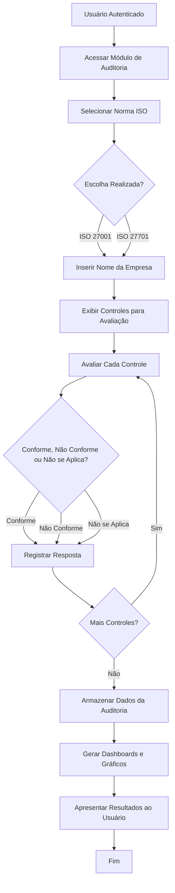
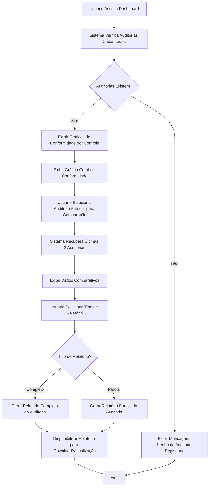

# Documentação Final do Sistema CyberSec

## 1. Apresentação 
O sistema CyberSec foi desenvolvido com o objetivo de fornecer uma base moderna e escalável para 
aplicações voltadas à auditoria de segurança da informação. A aplicação busca auxiliar organizações nos processos de avaliação de conformidade, gerenciamento de requisitos e acompanhamento[...]
Com o crescimento das ameaças digitais e da necessidade de proteção de dados, torna-se fundamental o desenvolvimento de sistemas que facilitem auditorias e análises de segurança.

## 2. Problema 
Muitas organizações encontram dificuldades no gerenciamento de auditorias de segurança da 
informação devido à ausência de ferramentas centralizadas e eficientes. Além disso, sistemas antigos apresentam limitações de escalabilidade, usabilidade e integração com tecnologias modernas[...]

## 3. Objetivos 

### 3.1. Objetivo Geral 
Desenvolver uma aplicação web moderna para gerenciamento e acompanhamento de auditorias de segurança da informação. 

### 3.2. Objetivos Específicos 
- Criar uma interface intuitiva 
- Desenvolver uma API 
- Integrar banco de dados SQL para armazenamento das informações
- Auxiliar auditorias relacionadas às normas ISO/IEC 27001 e ISO/IEC 27701
- Disponibilizar gráficos e relatórios para acompanhamento das auditorias

## 4. Justificativa 
A segurança da informação tornou-se um fator essencial para organizações de diferentes setores. Dessa forma, ferramentas que auxiliem processos de auditoria e conformidade são indispensáveis pa[...]

## 5. Funcionalidades do Sistema

## 6. Material e Método 
Para o desenvolvimento do sistema foram utilizadas tecnologias modernas tanto no front-end quanto no back-end. 

Tecnologias utilizadas 
Front-end: 
- React
- - React Router DOM - Tailwind CSS - Recharts 
Back-end: - .NET 10 
Banco de Dados: - SQL 
O desenvolvimento foi dividido entre interface gráfica, API e banco de dados, permitindo maior 
modularização e organização do projeto. 

## 7. Especificação de Requisitos 
7.1. Requisitos Funcionais 
7.2. Requisitos Não Funcionais 
7.3. Regras de Negócio 
 
 
 
## 8. Casos de Uso 
 
### Caso de Uso 1: Realizar Auditoria de Conformidade  

**Ator:** Usuário

**Descrição:** Essa funcionalidade permite que o usuário realize uma auditoria de conformidade baseada nas normas ISO/IEC 27001 e ISO/IEC 27701, utilizando os controles da ISO/IEC 27002 para diagnóstico e avaliação da conformidade da empresa.

**Pré-condição:** O usuário deve estar autenticado no sistema.

**Pós-condição:** Auditoria registrada e resultados apresentados no dashboard.

**Cenário Principal:**
- Passo 1: O usuário acessar o módulo de auditoria. 
- Passo 2: O usuário selecionar a norma desejada (ISO/IEC 27001 ou ISO/IEC 27701) 
- Passo 3: O sistema solicitar o nome da empresa auditada. 
- Passo 4: O usuário selecionar para cada um dos controle as opções: Conforme, Não Conforme ou Não se Aplica. 
- Passo 5: O sistema armazenará os dados e a data da auditoria.  
- Passo 6: O sistema apresentará dashboards e gráficos de conformidade agrupados por tipos de controle.

**Fluxograma:**

---

### Caso de Uso 2: Visualizar Dashboard e Relatórios

**Ator Principal:** Usuário

**Descrição:** Essa funcionalidade permite que o usuário visualize dashboards, gráficos e relatórios das auditorias realizadas, possibilitando análise comparativa entre auditorias anteriores.

**Pré-condição:** Existirem auditorias cadastradas no sistema.

**Pós-condição:** Apresentação dos relatórios e gráficos da auditoria.

**Cenário Principal:**
- Passo 1: O usuário acessar a área de dashboard.  
- Passo 2: O sistema apresentar gráficos de conformidade por tipos de controle.  
- Passo 3: O sistema apresentar gráfico geral de conformidade da auditoria.  
- Passo 4: O usuário selecionar uma auditoria anterior para comparação. 
- Passo 5: O sistema apresentar dados comparativos das últimas três auditorias.  
- Passo 6: O usuário selecionar o tipo de relatório desejado.
- Passo 7: O sistema gerar relatório completo ou parcial da auditoria.

**Fluxograma:**

