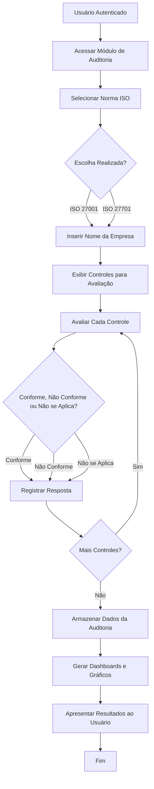
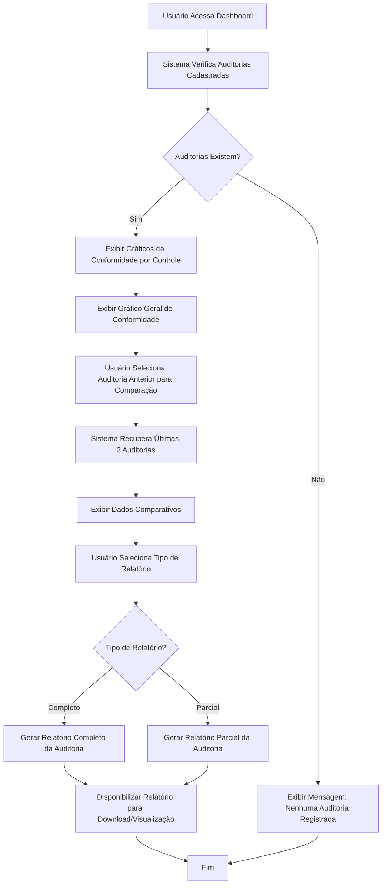
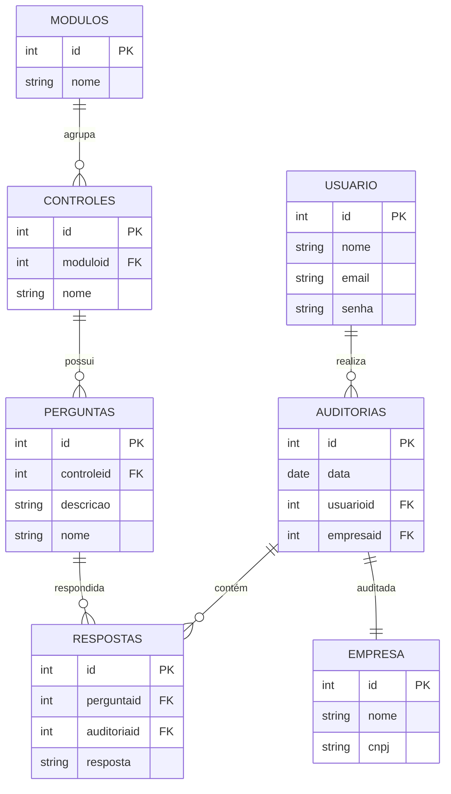

# Documentação Final do Sistema CyberSec

## 1. Apresentação 
O sistema CyberSec foi desenvolvido com o objetivo de fornecer uma base moderna e escalável para aplicações voltadas à auditoria de segurança da informação. A aplicação busca auxiliar organizações nos processos de avaliação de conformidade, gerenciamento de requisitos e acompanhamento de controles relacionados às normas ISO/IEC 27001 e ISO/IEC 27701. Com o crescimento das ameaças digitais e da necessidade de proteção de dados, torna-se fundamental o desenvolvimento de sistemas que facilitem auditorias e análises de segurança.

## 2. Problema 
Muitas organizações encontram dificuldades no gerenciamento de auditorias de segurança da informação devido à ausência de ferramentas centralizadas e eficientes. Além disso, sistemas antigos apresentam limitações de escalabilidade, usabilidade e integração com tecnologias modernas. Outro problema identificado é a complexidade no acompanhamento de requisitos das normas ISO/IEC 27001 e ISO/IEC 27701, dificultando o controle de conformidade e o registro das avaliações realizadas. 

## 3. Objetivos 

### 3.1. Objetivo Geral 
Desenvolver uma aplicação web moderna para gerenciamento e acompanhamento de auditorias de segurança da informação. 

### 3.2. Objetivos Específicos 
- Criar uma interface intuitiva 
- Desenvolver uma API 
- Integrar banco de dados SQL para armazenamento das informações
- Auxiliar auditorias relacionadas às normas ISO/IEC 27001 e ISO/IEC 27701
- Disponibilizar gráficos e relatórios para acompanhamento das auditorias

## 4. Justificativa 
A segurança da informação tornou-se um fator essencial para organizações de diferentes setores. Dessa forma, ferramentas que auxiliem processos de auditoria e conformidade são indispensáveis.

## 5. Funcionalidades do Sistema
### 5.1. Descrição

O sistema busca auxiliar o processo de auditoria de conformidade das normas ISO 27001 e ISO 27701, fornecendo recursos para gerenciamento de empresas, execução de auditorias, acompanhamento de resultados e geração de relatórios.

### 5.2. Dashboard Inicial

O dashboard inicial apresenta uma visão geral do sistema, exibindo indicadores principais relacionados às auditorias realizadas. Nessa tela são apresentados:

- Total de auditorias registradas no sistema;
- Total de empresas cadastradas;
- Quantidade de auditorias referentes às normas ISO 27001 e ISO 27701.

Além disso, a página exibe uma tabela contendo as cinco auditorias mais recentes, considerando as datas mais próximas da data atual.

No canto superior direito é apresentado o perfil do auditor autenticado no sistema, juntamente com um botão destinado à criação de uma nova auditoria. Já no canto esquerdo encontra-se o menu lateral de navegação, responsável pelo acesso às demais funcionalidades da aplicação.

### Cadastro e Inicialização de Auditorias

Ao selecionar a opção de nova auditoria, o sistema direciona o usuário para uma tela onde é possível:

- Cadastrar uma empresa;
- Selecionar o módulo de auditoria que será iniciado.

Após o salvamento da empresa, o sistema questiona se o usuário deseja iniciar imediatamente uma auditoria. Em caso positivo, é exibida a norma correspondente ao módulo selecionado e o processo de perguntas é iniciado.

Caso o usuário acesse novamente a funcionalidade de auditoria a partir do dashboard, o sistema apresenta uma caixa de diálogo simplificada, solicitando apenas a seleção do módulo desejado.

### 5.Gerenciamento de Empresas

A aba de empresas apresenta todas as organizações cadastradas e auditadas no sistema. Assim como no dashboard, também existe um botão específico para cadastro de novas empresas.

Ao selecionar uma empresa, o menu lateral é expandido automaticamente, disponibilizando opções para acesso aos registros de auditorias vinculados à empresa selecionada. Além disso, a barra superior esquerda passa a exibir o nome da empresa atualmente ativa no sistema.

### Execução das Auditorias

Durante a execução das auditorias, a interface apresenta uma barra de progresso contendo:

- Quantidade total de perguntas;
- Pergunta atual;
- Percentual de progresso da auditoria.

Abaixo da barra de progresso são exibidos:

- O módulo da auditoria;
- O controle correspondente;
- A pergunta a ser respondida.

As respostas disponíveis para cada pergunta são:

- Conforme;
- Não Implementado (Não Conforme);
- Em Andamento;
- Não se Aplica.

A interface também disponibiliza botões para retorno à pergunta anterior e cancelamento da auditoria.

### Relatórios de Auditoria

Para acessar os relatórios é necessário possuir uma empresa selecionada. Após a seleção, o menu lateral disponibiliza os módulos auditados para consulta.

Ao acessar um relatório, a página apresenta:

- Nome do módulo auditado;
- Botão para geração do relatório em PDF;
- Botão para seleção de auditorias anteriores.

As auditorias são identificadas pela data de realização, sendo carregada inicialmente a auditoria cuja data seja a mais próxima da data atual.

A interface também apresenta:

- Melhor score obtido no módulo, juntamente com data e auditor responsável;
- Score da auditoria selecionada;
- Data e auditor da auditoria atual.

Ao lado dessas informações é exibido um gráfico de evolução em curva, responsável por demonstrar a evolução dos resultados considerando até quatro auditorias mais recentes. Caso exista apenas uma auditoria cadastrada, o sistema exibe uma mensagem informativa indicando ausência de dados suficientes para comparação.

### Visualização Estatística

Os relatórios disponibilizam gráficos estatísticos para análise dos resultados obtidos:

- Gráfico de barras: apresenta a quantidade de respostas por categoria, exibindo os valores exatos ao passar o cursor do mouse;
- Gráfico de evolução: demonstra o nível de evolução entre auditorias;
- Gráfico de pizza: apresenta a distribuição percentual das respostas conforme suas respectivas categorias e cores.

### Detalhamento dos Controles

Na seção de respostas, o sistema inicialmente apresenta a porcentagem de conformidade de cada controle auditado.

Ao selecionar um controle específico, a seção é expandida automaticamente, exibindo:

- Perguntas vinculadas ao controle;
- Respostas registradas;
- Informações detalhadas da auditoria.

Também são disponibilizados botões de agrupamento, permitindo filtrar respostas por categoria:

- Conformes;
- Não Conformes;
- Em Andamento.
- Geração de Relatórios em PDF

O sistema permite gerar relatórios completos em formato PDF. Para que a geração ocorra corretamente, é necessário que o filtro agrupado esteja selecionado.

O relatório em PDF contém:

- Identificação da empresa;
- Módulo auditado;
- Data da auditoria;
- Nome do auditor responsável;
- Melhor nota geral obtida;
- Nota atual da auditoria selecionada.

Além disso, o documento inclui:

- Gráfico de evolução (quando houver mais de uma auditoria);
- Gráfico de barras;
- Gráfico de pizza;
- Listagem de controles com suas respectivas notas;
- Tabela contendo todas as perguntas e respostas detalhadas da auditoria.

## 6. Material e Método 
Para o desenvolvimento do sistema foram utilizadas tecnologias modernas tanto no front-end quanto no back-end. 

Tecnologias utilizadas 
Front-end: 
- React
- React Router DOM
- Tailwind CSS
- Recharts 

Back-end: 
- .NET 10 

Banco de Dados: 
- SQL 

O desenvolvimento foi dividido entre interface gráfica, API e banco de dados, permitindo maior modularização e organização do projeto. 

## 7. Especificação de Requisitos 

7.1. Requisitos Funcionais 

7.2. Requisitos Não Funcionais 

7.3. Regras de Negócio 
 
## 8. Casos de Uso 
 
### Caso de Uso 1: Realizar Auditoria de Conformidade  

**Ator:** Usuário

**Descrição:** Essa funcionalidade permite que o usuário realize uma auditoria de conformidade baseada nas normas ISO/IEC 27001 e ISO/IEC 27701, utilizando os controles da ISO/IEC 27002 para diagnóstico e avaliação da conformidade da empresa.

**Pré-condição:** O usuário deve estar autenticado no sistema.

**Pós-condição:** Auditoria registrada e resultados apresentados no dashboard.

**Cenário Principal:**
- Passo 1: O usuário acessar o módulo de auditoria. 
- Passo 2: O usuário selecionar a norma desejada (ISO/IEC 27001 ou ISO/IEC 27701) 
- Passo 3: O sistema solicitar o nome da empresa auditada. 
- Passo 4: O usuário selecionar para cada um dos controle as opções: Conforme, Não Conforme ou Não se Aplica. 
- Passo 5: O sistema armazenará os dados e a data da auditoria.  
- Passo 6: O sistema apresentará dashboards e gráficos de conformidade agrupados por tipos de controle.

**Fluxograma:**

---

### Caso de Uso 2: Visualizar Dashboard e Relatórios

**Ator Principal:** Usuário

**Descrição:** Essa funcionalidade permite que o usuário visualize dashboards, gráficos e relatórios das auditorias realizadas, possibilitando análise comparativa entre auditorias anteriores.

**Pré-condição:** Existirem auditorias cadastradas no sistema.

**Pós-condição:** Apresentação dos relatórios e gráficos da auditoria.

**Cenário Principal:**
- Passo 1: O usuário acessar a área de dashboard.  
- Passo 2: O sistema apresentar gráficos de conformidade por tipos de controle.  
- Passo 3: O sistema apresentar gráfico geral de conformidade da auditoria.  
- Passo 4: O usuário selecionar uma auditoria anterior para comparação. 
- Passo 5: O sistema apresentar dados comparativos das últimas três auditorias.  
- Passo 6: O usuário selecionar o tipo de relatório desejado.
- Passo 7: O sistema gerar relatório completo ou parcial da auditoria.

**Fluxograma:**

---

## 9. Modelo de Banco de Dados

O banco de dados do sistema CyberSec foi modelado relacionalmente, garantindo a integridade referencial e a normalização dos dados. Abaixo está representado o diagrama entidade-relacionamento (ER):

### Diagrama ER - Banco de Dados CyberSec

### Descrição das Tabelas

| Tabela | Descrição |
|--------|-----------|
| **USUARIO** | Armazena informações dos usuários do sistema (autenticação e perfil) |
| **EMPRESA** | Contém dados das empresas que serão auditadas (nome e CNPJ) |
| **AUDITORIAS** | Registra as auditorias realizadas, relacionando usuário e empresa |
| **MODULOS** | Agrupa os controles em módulos temáticos (ex: Políticas, Organização, etc) |
| **CONTROLES** | Define os controles de segurança baseados na ISO/IEC 27002 |
| **PERGUNTAS** | Contém as perguntas específicas de cada controle |
| **RESPOSTAS** | Armazena as respostas fornecidas durante cada auditoria |

### Relacionamentos Principais

- **USUARIO → AUDITORIAS**: Um usuário pode realizar múltiplas auditorias
- **AUDITORIAS → EMPRESA**: Cada auditoria está associada a uma empresa
- **AUDITORIAS → RESPOSTAS**: Cada auditoria contém múltiplas respostas
- **PERGUNTAS → RESPOSTAS**: Cada pergunta pode ter múltiplas respostas (de diferentes auditorias)
- **CONTROLES → PERGUNTAS**: Cada controle possui múltiplas perguntas associadas
- **MODULOS → CONTROLES**: Cada módulo agrupa múltiplos controles
