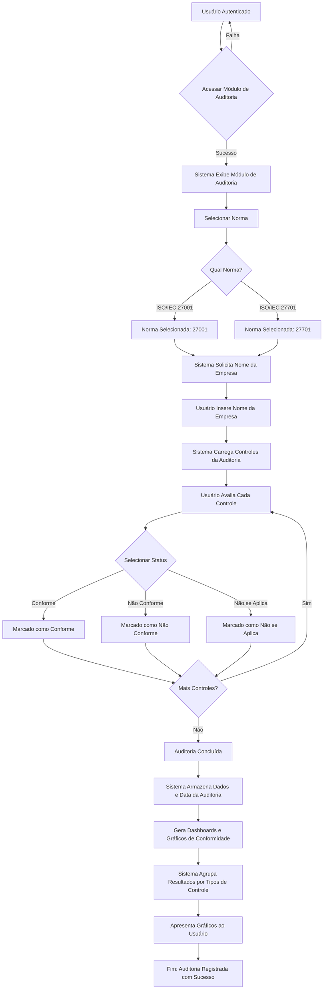
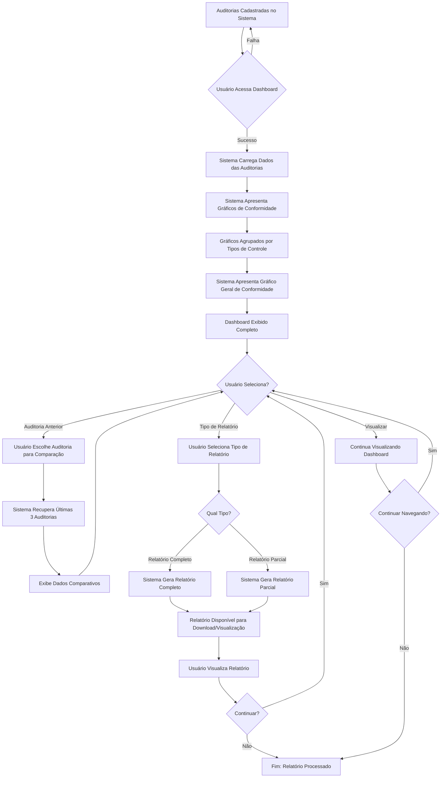

# Fluxogramas dos Casos de Uso - Sistema CyberSec

## Caso de Uso 1: Realizar Auditoria de Conformidade

---

## Caso de Uso 2: Visualizar Dashboard e Relatórios

---

## Resumo dos Fluxos

| Caso de Uso | Início | Fim |
|------------|--------|-----|
| Auditoria de Conformidade | Usuário Autenticado | Auditoria Registrada com Gráficos |
| Dashboard e Relatórios | Auditorias Cadastradas | Relatório Processado |

---

## Atores Identificados
- **Usuário**: Realiza auditorias e visualiza dashboards
- **Sistema**: Processa dados, gera gráficos e armazena informações

## Elementos Críticos dos Fluxos
1. **Autenticação**: Obrigatória para auditoria
2. **Validação**: Cada seleção é validada antes do prosseguimento
3. **Armazenamento**: Dados persistidos após conclusão
4. **Geração de Relatórios**: Dinâmica baseada na seleção do usuário
